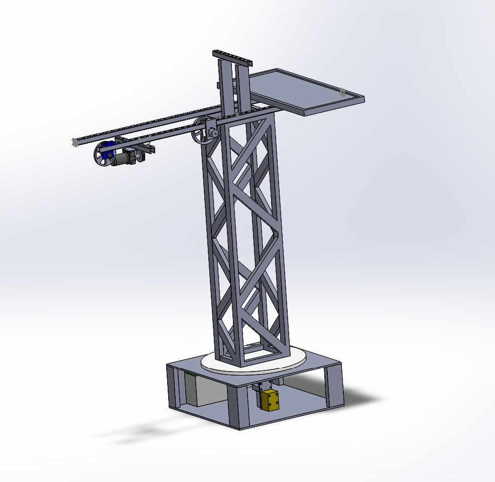
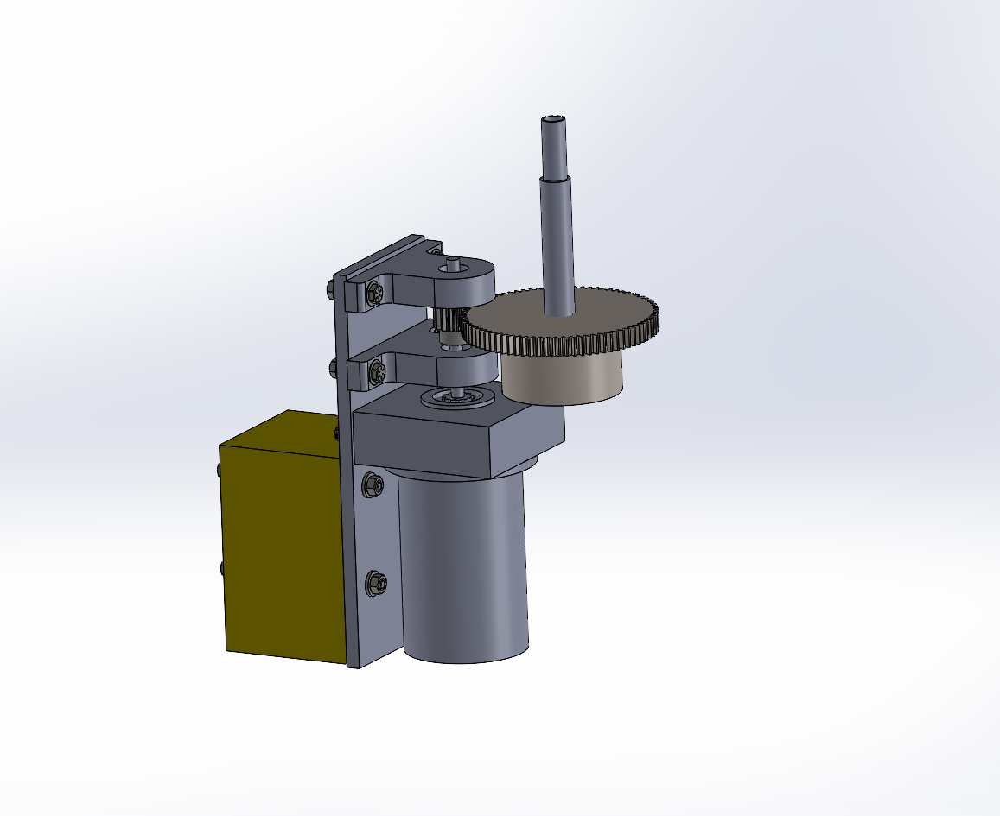
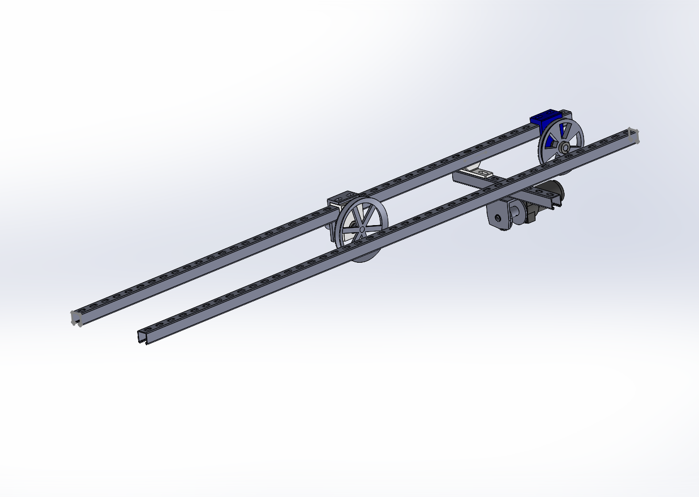
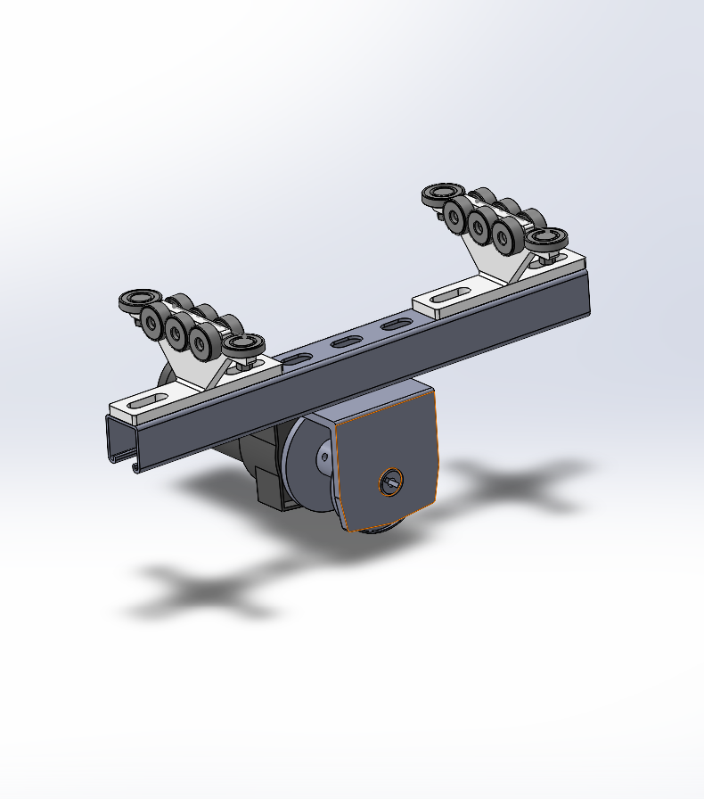
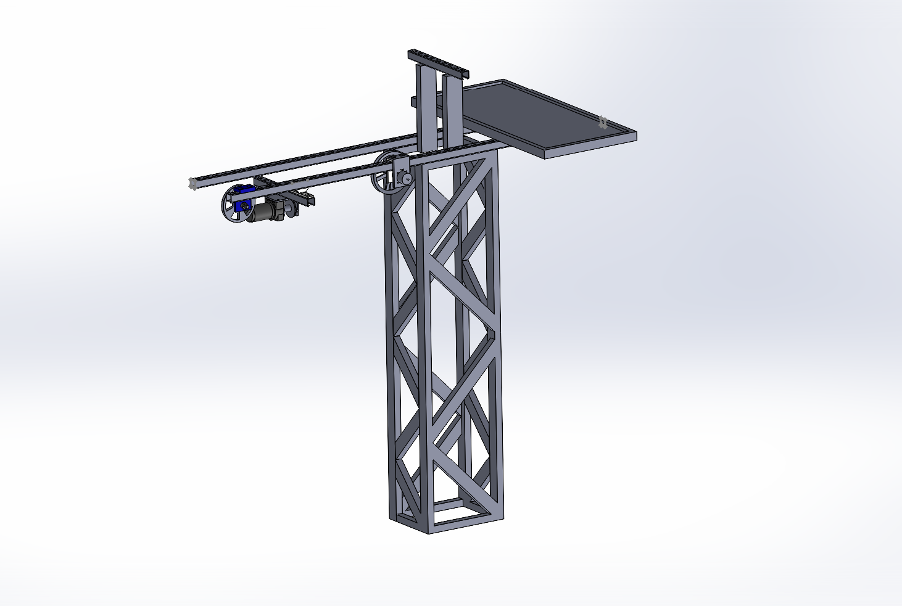

# Modeling and Design

The team made a full assembly CAD model of the Crane with placeholders for some of the electrical components like the battery source. This gave them a good idea of some of the spacing available for supports around the center shaft. 

# Technical Drawings
The team's technical drawing package is linked below. 
