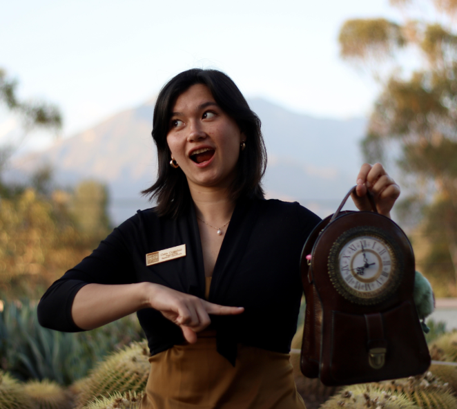
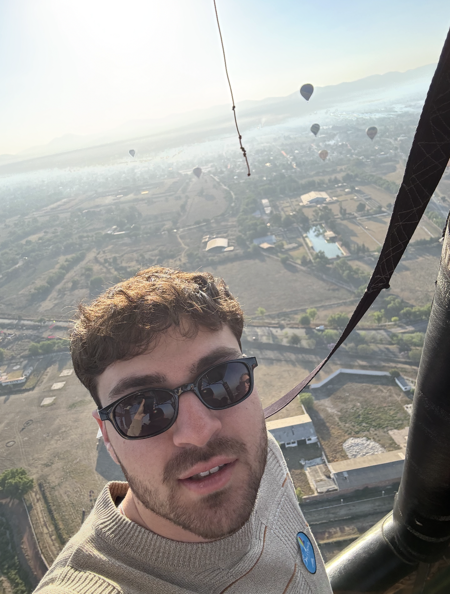
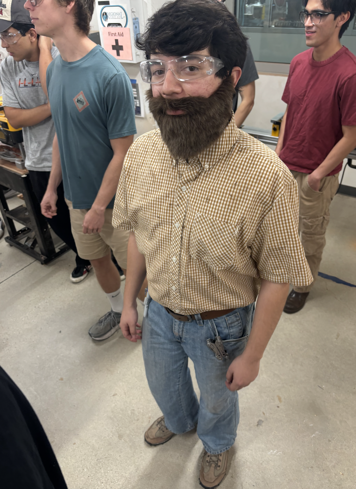
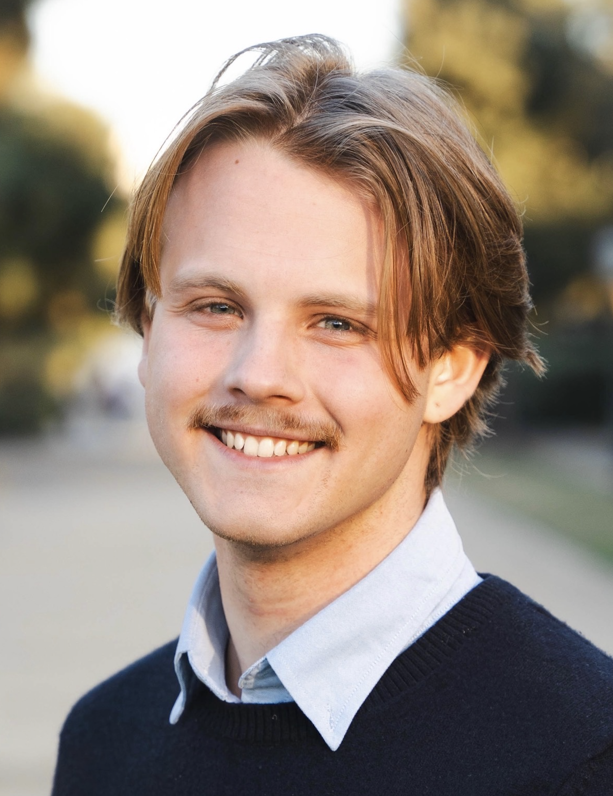

# Meet the Team!

## Caiya Coggshall HMC '26

**Caiya Coggshall** (or affectionately known as “caiya papaya”) is a senior engineer specializing in manufacturing with an interest in biomedical devices and aero systems! ​Some of her past experience involves fabricating and testing fixtures to support the development of a Class III medical device and leading a team of 5 to manufacture an automated ECMO cannulation device. On campus she works as machine shop proctor (proctor x1) and leads as the external operations coordinator of the tours program at Harvey Mudd College (guide x1). She is also a dorm president (president x1) at South Dorm #southinyourmouth. The link to her [personal portfolio](https://caiyacoggshall7.github.io/professional-portfolio/) and [LinkedIn](https://www.linkedin.com/in/caiyacoggshall/) can be found here.

## Abdullah Fattahi HMC '26

**Abdullah Fattahi** (or affectionately known as “uncdullah”)  is a senior engineering major specializing in mechanical systems with an interest in climate and renewable technologies. Some of his past projects include redesigning a testing device for hydrogen fuel cells to optimize catalyst efficiency and building mechanical solution for a liquid-solid separation system in a direct air capture unit. On campus he works as a machine shop proctor (proctor x2) and a seasoned tour guide (guide x2). He is also a dorm president (president x2) at West Dorm #wibstr. The link to his [LinkedIn](https://www.linkedin.com/in/abdullahfattahi/) can be found here.

## Ever Diaz-Ramos HMC '27

**Ever Diaz-Ramos** (or affectionately known as “the boba guzzler”) is the resident junior engineer on the project and is specializing in mechanical engineering with an emphasis in experimental design and cooling technologies. Some of his past projects include designing and experimental procedure writing of a hydrogen-helium gas recycler and thermal testing of a vapor-chamber medicine cold storage. Although a junior compared to the rest, he works on campus as a tour guide (guide x3) and associate head shop proctor (proctor x3) and so is the boss of all these oldies! The link to his [LinkedIn](https://www.linkedin.com/in/ever-diaz-ramos/) can be found here.

## Avery Smith HMC '26

**Avery Smith** (or affectionately known as “Avery Smith”)  is a senior engineering major specializing in electrical and mechanical systems. Some of his past projects include improving crystal CO2  extraction for a DAC system, modeling properties and chemical properties of triglycerides to produce a virtual tool to accelerate synthetic fat production, and making a microcontroller-based DMX lighting controller. On campus he works as a machine shop proctor (proctor x4) and can often be found singing his heart out for one of the acapella groups on campus: the Claremont Shades (acapella x1). The link to his [LinkedIn](https://www.linkedin.com/in/avery-smith-434ab4262/) can be found here.

